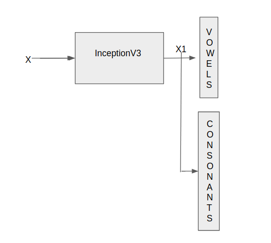
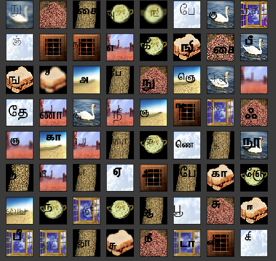

# Table of Contents

* 1. [Setting up the project dependencies](#Settinguptheprojectdependencies)
* 2. [Running the code](#Runningthecode)
	* 2.1. [Using the jupyter notebook](#Usingthejupyternotebook)
	* 2.2. [Running the code using CLI](#RunningthecodeusingCLI)
* 3. [Results](#Results)
	* 3.1. [Model Architecture](#ModelArchitecture)
	* 3.2. [Samples](#Samples)
	* 3.3. [Accuracy](#Accuracy)
* 4. [TODO](#TODO)
* 5. [Author](#Author)

# Vowel consonant classification

This repository contains code and results for detecting vowels and consonants in Tamil language characters.

# Diving into the code

##  1. Setting up the project dependencies

1) Install pipenv using the command `pip insalll pipenv`
2) Install the project dependencies by running the command `pipenv install` in the project directory which will set up the dependencies after creating a virtual env.

##  2. Running the code

###  2.1. Using the jupyter notebook

You can find the jupyter notebook for this project in `notebooks/Vowel_consonant_classification.ipynb`. Running it should be fairly simple as the code is well-commented and explained fairly well.

###  2.2. Running the code using CLI

In the project directory use the following commands:

**For training**:
`vc train `

**For testing**:
`vc eval <model_path> <test_dataset_path>`

> <model_path> is the path to the saved pytorch model. One such model is in the `classifier/results/` directory

> <test_dataset_path> is the path to a directory containing the test images.

The file `config.yaml` stores the configuration of the classifier.

##  3. Results

###  3.1. Model Architecture
Used the InceptionV3 network for fine-tuning on the dataset.

The architecture is shown below:

where X is the input image, X1 are the extracted features which are passed through two classifiers for detecting the Vowel and the consonants. The number of Vowels in Tamil language are:13 and the consonant count is 19.

###  3.2. Samples
Some samples from the training dataset are shown in the figure below. The training data used is a synthetic dataset.

###  3.3. Accuracy

The test set accuracy on the dataset from this method is around 94.04% on a test set size of around 10000 samples.

##  4. TODO

1) Compute the accuracy after introducing Mixup data augmentation and compute the results.
2) Try out other model architectures like ResNeXT, WideResNet and ResNet-152 and compare the results

##  5. Author

Kushagra Pandey / @kpandey008
